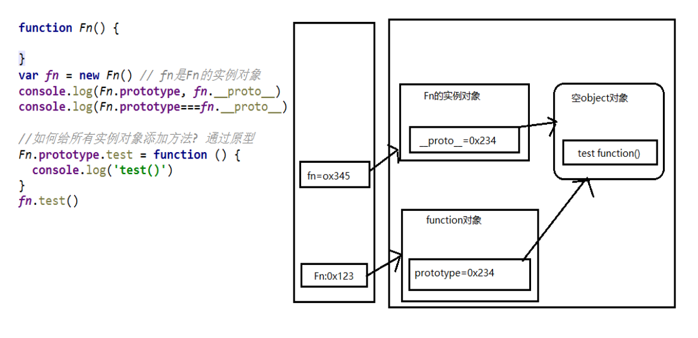
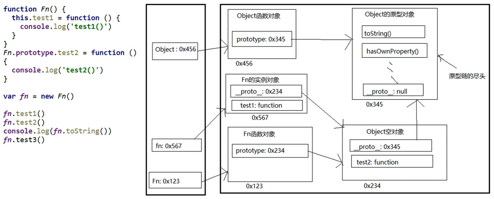
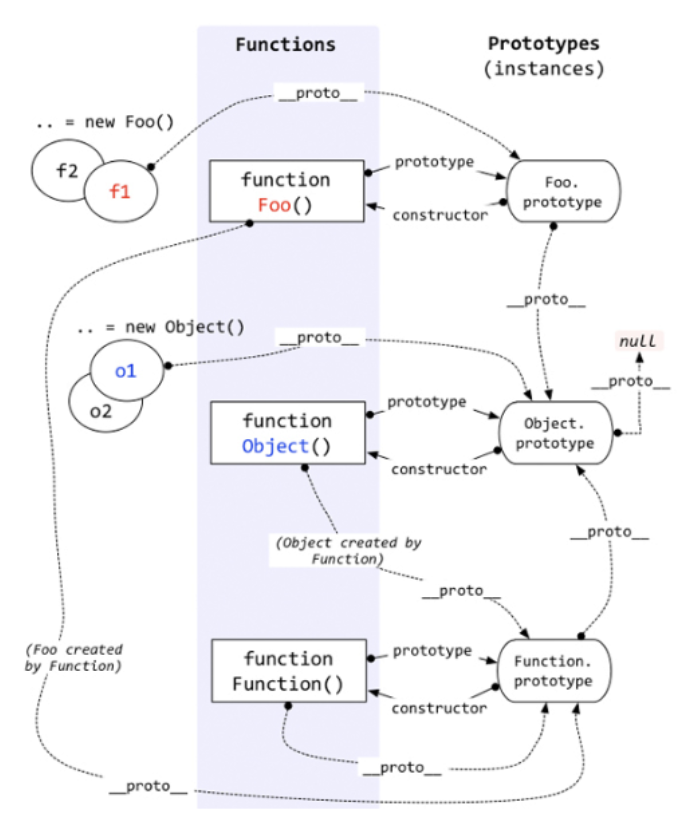

# 一、显式原型与隐式原型

**显式原型**

每个函数都有一个prototype属性, 即显式原型；

它默认指向一个空 `Object` 实例对象(即称为: 原型对象)；

原型对象中有一个属性constructor, 它指向函数对象。

**隐式原型**

每个实例对象都有一个__proto__，可称为隐式原型；

对象的隐式原型的值为其对应构造函数的显式原型的值。


**给原型对象添加属性(一般都是方法)**

**作用**：函数的所有实例对象自动拥有原型中的属性(方法)



# 二、原型链

1. 原型链

- 别名: **隐式原型链** 
- 作用: 查找对象的属性(方法) 

- 访问一个对象的属性时， 

- -  先在自身属性中查找，找到返回 
  -  如果没有, 再沿着**proto**这条链向上查找, 找到返回 

- -  如果最终没找到, 返回undefined



1. 原型继承：构造函数的实例对象自动拥有构造函数原型对象的属性(方法)，利用的就是原型链。
2. 原型链尽头：Object.prototype

# 三、探索instanceof

1. instanceof是如何判断的?

-  表达式: A instanceof B 
-  如果B函数的显式原型对象在A对象的原型链上, 返回true, 否则返回false 

1. Function是通过new自己产生的实例



总结几句话：

函数的隐式原型的值默认是空的Object实例对象（Object除外）。

对象的隐式原型的值为其对应构造函数的显式原型的值。

所有函数都是Function的实例，包括Object、Function。

Function是通过new自己产生的实例。

# 四、面试题

```3
/*
测试题1
*/
var A = function () { }
A.prototype.n = 1

var b = new A()
A.prototype = {
    n: 2,
    m: 3
}

var c = new A()
console.log(b.n, b.m, c.n, c.m) // 1 undefined 2 3

/*
测试题2
*/
var F = function () { };
Object.prototype.a = function () {
    console.log('a()')
};
Function.prototype.b = function () {
    console.log('b()')
};

var f = new F();
f.a() // a()
f.b() // typeError
F.a() // a()
F.b() // b()
```