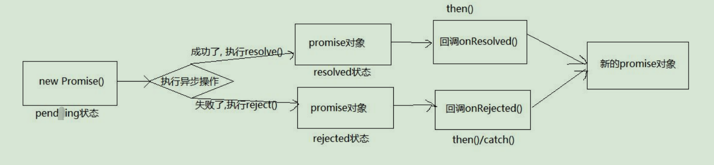

# Promise

## 第1章：准备

### 1.1 区别实例对象和函数对象

1. 实例对象：`new` 函数产生的对象，称为**实例对象**，简称对象；
2. 函数对象：将函数作为对象使用时，简称为**函数对**

```js
function Fn() {   // Fn函数 
}
const fn = new Fn() // Fn是构造函数  fn是实例对象(简称为对象)
console.log(Fn.prototype) // Fn是函数对象
Fn.call({}) // Fn是函数对象

// 区别函数和函数对象
// 在于函数名后加的是括号还是点，括号则是函数，点则是函数对象
$('#test') // jQuery函数
$.get('/test') // jQuery函数对象

function Person(params) {

}
```

### 1.2 两种类型的回调函数

> 回调函数必须满足三个条件：1.我定义的；2.我没调用；3.最终调用了。

#### 1.2.1 同步回调

1. 理解：立即执行，完全执行完了才结束，不会放入回调队列中
2. 例子：数组遍历相关的回调函数 / `Promise` 的 `excutor` 函数（具体看下文）

#### 1.2.2 异步回调

1. 理解：不会立即执行，会放入回调队列中将来执行
2. 例子：定时器回调 / `ajax` 回调 / `Promise` 的成功或失败的回调（具体看下文）

> ##### 如何区分同步回调和异步回调？
>
> 在回调函数之后打印输出内容；
>
> 如果内容在回调函数执行之后输出，则是同步回调；反之则是异步回调。

```js
// 1. 同步回调函数
// const arr = [1, 3, 5]
arr.forEach(item => { // 遍历回调, 同步回调函数, 不会放入列队, 一上来就要执行完
  console.log(item)
})
console.log('forEach()之后')

// 2. 异步回调函数
setTimeout(() => { // 异步回调函数, 会放入队列中将来执行
  console.log('timout callback()')
}, 0)
console.log('setTimeout()之后')
```

### 1.3 `JS` 的 `error` 处理

#### 1.3.1 错误的类型

1. `Error`：所有错误的父类型
2. `ReferenceError`：引用的变量不存在；如：未声明之下打印一个变量: `console.log(a)`
3. `TypeError`：数据类型不正确的错误，如：把一个普通变量当对象用：`let b; console.log(b.xxx)`
4. `RangeError`：数据值不在其所允许的范围内，如：递归溢栈
5. `SyntaxError`：语法错误，如：`console.log("""")`

#### 1.3.2 错误处理

1. 捕获处理错误：`try...catch`
2. 抛出错误：`throw error`；由调用者决定如何处理错误，后面可以捕获再处理

#### 1.3.3 error 对象的结构

`error` 对象有两个属性：`message` 和 `stact`

`message` 属性：错误相关信息

`stack` 属性：函数调用栈记录信息（可打断点查看）

```js
/* 
目标: 进一步理解JS中的错误(Error)和错误处理
  mdn文档: https: //developer.mozilla.org/zh-CN/docs/Web/JavaScript/Reference/Global_Objects/Error

  1. 错误的类型
      Error: 所有错误的父类型
      ReferenceError: 引用的变量不存在
      TypeError: 数据类型不正确的错误
      RangeError: 数据值不在其所允许的范围内
      SyntaxError: 语法错误
  2. 错误处理
      捕获错误: try ... catch
      抛出错误: throw error
  3. 错误对象
      message属性: 错误相关信息
      stack属性: 函数调用栈记录信息
*/

// 1. 常见的内置错误
// 1). ReferenceError: 引用的变量不存在
// console.log(a) // ReferenceError: a is not defined
// console.log('-----') // 没有捕获error, 下面的代码不会执行

// TypeError: 数据类型不正确的错误
// let b
// // console.log(b.xxx) // TypeError: Cannot read property 'xxx' of undefined
// b = {}
// b.xxx() // TypeError: b.xxx is not a function


// RangeError: 数据值不在其所允许的范围内
// function fn() {
//   fn()
// }
// fn() // RangeError: Maximum call stack size exceeded

// SyntaxError: 语法错误
// const c = """" // SyntaxError: Unexpected string


// 2. 错误处理
// 捕获错误: try ... catch
// try {
//   let d
//   console.log(d.xxx)
// } catch (error) {
//   console.log(error.message)
//   console.log(error.stack)
// }
// console.log('出错之后')

// 抛出错误: throw error
function something() {
  if (Date.now()%2===1) {
    console.log('当前时间为奇数, 可以执行任务')
  } else { // 如果时间是偶数抛出异常, 由调用来处理
    throw new Error('当前时间为偶数无法执行任务')  
  }
}

// 捕获处理异常
try {
  something()
} catch (error) {
  alert(error.message)
}
```

## 第2章：promise 的理解和使用

### 2.1 Promise 是什么？

#### 2.1.1 理解

1. 抽象表达

   `Promise` 是 `JS` 中*进行***异步编程**的**新**的**解决方案**

2. 具体表达

   （1）从**语法**上来说：`Promise` 是一个构造函数

   （2）从**功能**上来说：`promise` 对象用来封装一个异步操作并可以*获取*其结果

#### 2.1.2 promise 状态改变

`promise` 对象只能有三种状态，`pending`、`resolved`、`rejected`，而状态改变只有以下两种情况。

1. `pending` 变为 `resolved`
2. `pending` 变为 `rejected`

> **说明**
>
> ​	状态改变只有这两种，而且一个 `promise` 对象只能改变一次
>
> ​	无论变为成功或者失败，都会有一个最终结果；成功的结果数据*一般称为* `value`，失败的结果数据一般称为 `reason`
>

#### 2.1.3 promise 的基本流程



#### 2.1.4 promise 的基本使用

```js
// 1. 创建一个新的promise对象
const p = new Promise((resolve, reject) => {// 执行器函数  同步回调
  console.log('执行 excutor')
  // 2. 执行异步操作任务
  setTimeout(() => {
    const time = Date.now() // 如果当前时间是偶数就代表成功, 否则代表失败
    // 3.1. 如果成功了, 调用resolve(value)
    if (time %2 == 0) {
      resolve('成功的数据, time=' + time)
    } else {
    // 3.2. 如果失败了, 调用reject(reason)
      reject('失败的数据, time=' + time)
    }
  }, 1000);
  
})
console.log('new Promise()之后')

// setTimeout(() => {
  p.then(
  value => { // 接收得到成功的value数据    onResolved
    console.log('成功的回调', value)  
  },
  reason => {// 接收得到失败的reason数据  onRejected
    console.log('失败的回调', reason)
  }
 )
// }, 2000);
```

### 2.2 为什么要用 promise ？ 

#### 2.2.1 指定回调函数的方式更加灵活

1. 旧的（纯回调函数）：必须在启动异步任务之前指定

2. `promise`：启动异步任务 => 返回 `promise` 对象 => 给 `promise` 对象绑定回调函数（甚至可以在异步任务结束后指定【可加定时器】/多个）

   （一般情况下是先绑定回调函数然后异步任务再执行完毕：异步任务执行需要时间嘛，那么就会先执行下面的代码，会调用 `then()` 方法，从而绑定回调函数）

#### 2.2.2 支持链式调用，可以解决回调地狱问题

1. 什么是回调地狱？

   回调函数嵌套调用，外部回调函数异步执行的结果是嵌套的回调执行的条件

   （回调函数层层嵌套，外面的回调函数执行完了，才会把结果传给里面的回调函数，*作为条件*）

2. 回调地狱的缺点？

   不便于阅读

   不便于异常处理

3. 解决方案？

   `promise` 链式调用

4. 最终解决方案？

   `async/await`

```js
  // 成功的回调函数
  function successCallback(result) {
    console.log("声音文件创建成功: " + result);
  }
  // 失败的回调函数
  function failureCallback(error) {
    console.log("声音文件创建失败: " + error);
  }

  /* 1.1 使用纯回调函数 */
  createAudioFileAsync(audioSettings, successCallback, failureCallback)
  
  /* 1.2. 使用Promise */
  const promise = createAudioFileAsync(audioSettings); // 2
  setTimeout(() => {
    promise.then(successCallback, failureCallback);
  }, 3000);
  
  /* 
  2.1. 回调地狱
  */
  doSomething(function(result) {
    doSomethingElse(result, function(newResult) {
      doThirdThing(newResult, function(finalResult) {
        console.log('Got the final result: ' + finalResult)
      }, failureCallback)
    }, failureCallback)
  }, failureCallback)

  /* 
  2.2. 使用promise的链式调用解决回调地狱
  */
  doSomething()
  .then(function(result) {
    return doSomethingElse(result)
  })
  .then(function(newResult) {
    return doThirdThing(newResult)
  })
  .then(function(finalResult) {
    console.log('Got the final result: ' + finalResult)
  })
  .catch(failureCallback)

  /* 
  2.3. async/await: 回调地狱的终极解决方案
  */
  async function request() {
    try {
      const result = await doSomething()
      const newResult = await doSomethingElse(result)
      const finalResult = await doThirdThing(newResult)
      console.log('Got the final result: ' + finalResult)
    } catch (error) {
      failureCallback(error)
    }
  }
```

### 2.3 如何使用 promise ？

#### 2.3.1 API

1. `Promise` 构造函数： `Promise (excutor) {}`

   `excutor` 函数：同步执行 `(resolve, reject) => {}`

   `resolve` 函数：内部定义成功时我们调用的函数 `value => {}`

   `reject` 函数：内部定义失败时我们调用的函数 `reason => {}`

2. `Promise.prototype.then` 方法：`(onResolved, onRejected) => {}`

   `onResolved` 函数：成功的回调函数 `(value) => {}`

   `onRejected` 函数：失败的回调函数 `(reason) => {}`

   说明：指定用于得到成功 `value` 的成功回调和用于得到失败 `reason` 的失败回调，返回一个新的 `promise` 对象

3. `Promise.prototype.catch` 方法：`(onRejected) => {}`

   `onRejected` 函数：失败的回调函数 `(reason) => {}`

   说明： `then()` 的语法糖，相当于：`then(undefined, onRejected)`

4. `Promise.resolve` 方法：`(value) => {}`

   `value`：成功的数据或 `promise` 对象

   说明：返回一个成功/失败的 `promise` 对象

5. `Promise.reject` 方法：`(reason) => {}`

   `reason`：失败的原因

   说明：返回一个失败的 `promise` 对象

6. `Promise.all` 方法：`(promises) => {}`

   `promises`：包含 `n` 个 `promise` 的数组

   说明：返回一个新的 `promise`，只有所有的 `promise` 都成功才成功，只要有一个失败了就直接失败

7. `Promise.race` 方法：`(promises) => {}`

   `promise`：包含 `n` 个 `promise` 的数组

   说明：返回一个新的 `promise`，第一个完成的 `promise` 的结果状态就是最终的结果状态

```js
new Promise((resolve, reject) => {
    setTimeout(() => {
        // resolve('成功的数据')
        reject('失败的数据')
    }, 1000)
}).then(
value => {
    console.log('onResolved()1', value)
}
).catch(
reason => {
    console.log('onRejected()1', reason)
}
)

// 产生一个成功值为1的promise对象
const p1 = new Promise((resolve, reject) => {
    setTimeout(() => {
    resolve(1)
    }, 100);
})
const p2 = Promise.resolve(2)
const p3 = Promise.reject(3)
//    p1.then(value => {console.log(value)})
//    p2.then(value => {console.log(value)})
//    p3.catch(reason => {console.log(reason)})

//    const pAll = Promise.all([p1, p2, p3])
const pAll = Promise.all([p1, p2])
/* pAll.then(
  values => {
    console.log('all onResolved()', values)
  },
  reason => {
    console.log('all onRejected()', reason)
  }
)
*/
const pRace = Promise.race([p1, p2, p3])
pRace.then(
  value => {
    console.log('race onResolved()', value)
  },
  reason => {
    console.log('race onRejected()', reason)
  }
)
```

#### 2.3.2 promise 的几个关键问题

1. 如何改变 `promise` 的状态？

   （1）`resolve(value)`：如果当前是 `pending` 就会变为 `resolved`

   （2）`reject(reason)`：如果当前是 `pending` 就会变为 `rejected`

   （3）抛出异常：如果当前是 `pending` 就会变为 `rejected`

   

2. 一个 `promise` 指定多个成功/失败回调函数，都会调用吗？

   当 `promise` 改变为对应状态时都会调用

   

3. 改变 `promise` 状态和指定回调函数谁先谁后？

   （1）都有可能，正常情况下是先指定回调再改变状态，但也可以先改变状态再指定回调

   （2）如何先改状态再指定回调？

   - 在执行器中直接调用 `resolve()/reject()`
   - 延迟更长时间才调用 `then()`

   （3）什么时候才能得到数据？

   ​      关键在于回调函数调用时，才能得到数据

   - 如果先指定的回调，那当状态发生改变时，回调函数就会调用，得到数据

   - 如果先改变的状态，那当指定回调时，回调函数就会调用，得到数据

     

4. `promise.then()` 返回的新 `promise` 的结果状态由什么决定？

   （1）简单表达：由 `then()` 指定的回调函数执行的结果决定

   （2）详细表达：

   - 如果抛出异常，新 `promise` 变为 `rejected`，`reason` 为抛出的异常

   - 如果返回的是非 `promise` 的任意值，新 `promise` 变为 `resolved`，`value` 为返回的值

   - 如果返回的是另一个新 `promise`，那么返回的 `promise` 的结果就会成为新（原来的） `promise` 结果

     

5. `promise` 如何串连多个操作任务？

   （1）`promise` 的 `then()` 返回一个新的 `promise`，可以看成 `then()` 的链式调用

   （2）通过 `then` 的链式调用串连多个同步/异步任务

   

6. `promise` 异常传/穿透？

   （1）当使用 `promise` 的 `then` 链式调用时，可以在最后指定失败的回调

   （2）前面任何操作出了异常，都会传到最后失败的回调中处理

   

7. 中断 `promise` 链？

   （1）当使用 `promise` 的 `then` 链式调用时，在中间中断，不再调用后面的回调函数

   （2）方法：在回调函数中返回一个状态为 `pending` 的 `promise` 对象

