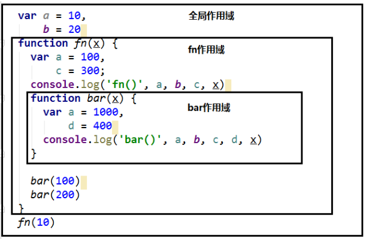
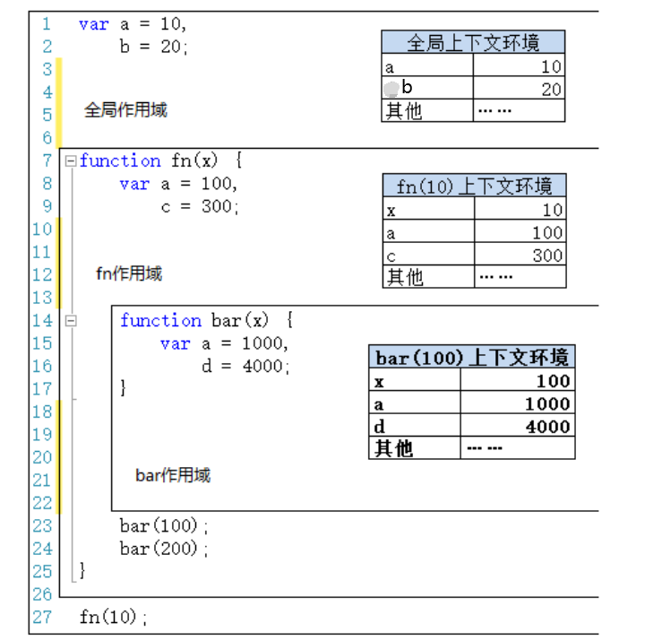
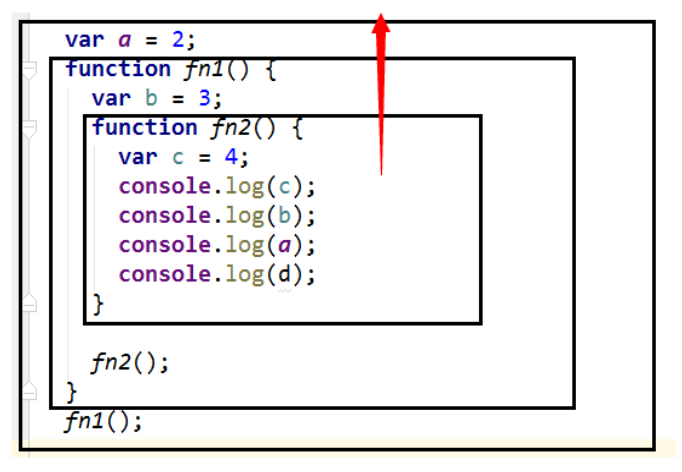

# 作用域

## 1 作用域

### 1.1 理解

作用域，是变量和函数生效（能被访问）的区域。

### 1.2 作用

隔离变量，不同作用域下同名变量不会有冲突。

### 1.3 分类

- 全局作用域
- 函数作用域
- 块级作用域（`ES6` 新增的）

## 2 作用域与执行上下文

### 2.1 区别

#### 区别1：创建时间

- 全局作用域以外，每个函数都会创建自己的作用域，作用域在函数定义时就已经确定了，而不是在函数调用时
- 全局执行上下文是在全局作用域确定之后，`js` 代码马上执行之前创建
- 函数执行上下文是在函数调用时，函数体代码执行之前创建

#### 区别2：一静一动

- 作用域是静态的，只要函数定义好了就一直存在，且不会再变化
- 执行上下文是动态的，调用函数时创建，函数调用结束后上下文环境就会被释放

### 2.2 联系

- 上下文环境（对象）从属于所在的作用域
  - 全局上下文环境 ==> 全局作用域
  - 函数上下文环境 ==> 对应的函数作用域

## 3 作用域链

### 3.1 理解

- 多个上下级关系的作用域形成的链，它的方向是从下向上的
- 查找变量时就是沿着作用域链来查找的

### 3.2 变量查找规则

- 第一步：在当前作用域下的执行上下文对象中查找对应的属性，如果有直接返回，否则进入第二步；
- 第二步：在上一级作用域的执行上下文对象中查找对应的属性，如果有直接返回，否则进入第三步；
- 第三步：再次执行第二步的操作，直到全局作用域，如果还找不到就抛出找不到的异常。

## 4 词法作用域

未完待续...

问题：

作用域会变？书里说会

作用域在函数执行后会消失？书里说不会

作用域在函数执行后会如何变化？

